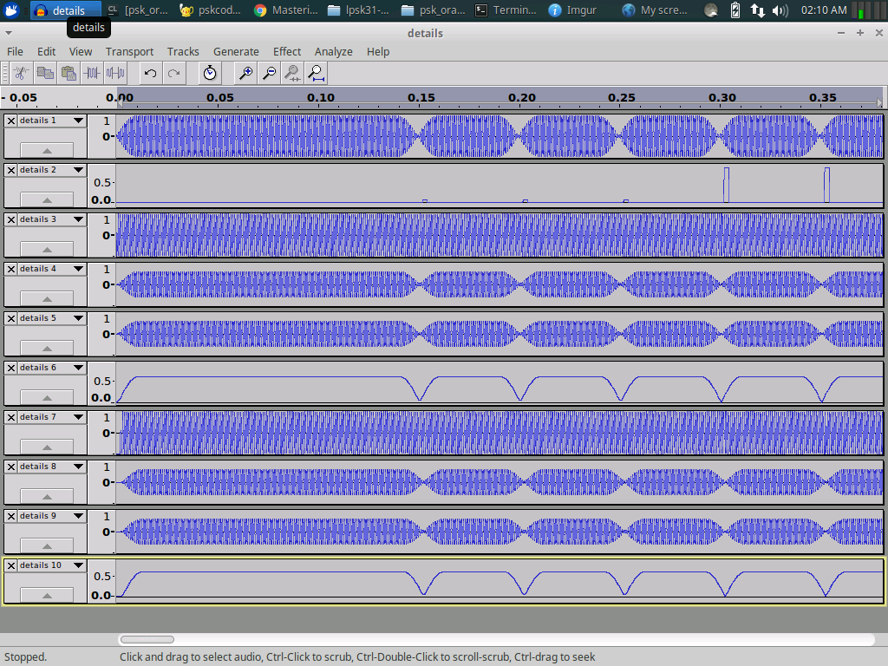
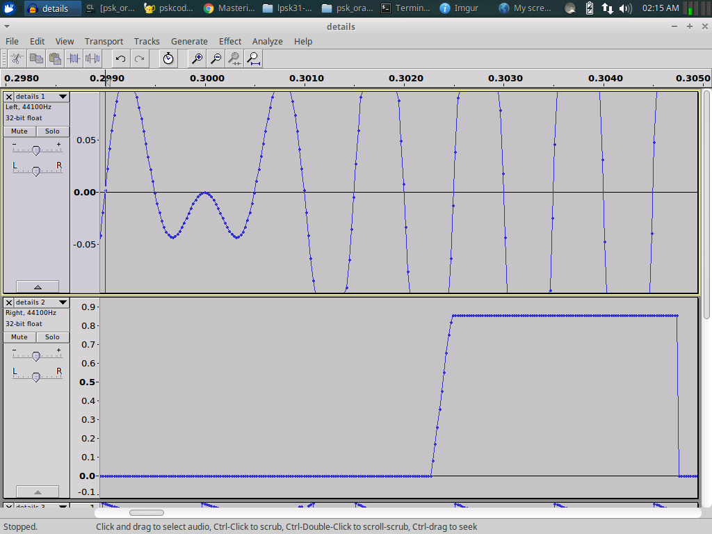

# psk_orange
Homebrew psk31 codec, as can be seen in ham radio circles. The codec only does a delta-code, not the varicode standard that psk31 uses. Implementing varicode may be a project for another time...

Main() writes the ascii bits for "Hello World!" to the screen and calls an encoder to also write those bits to a phase-shit-keyed audio file (headerless uncompressed int16 binary, sample rate of 22050hz and a tone frequency of 500hz). This audio file is then read back and decoded.

This is the ascii of the encoded string:
`00010010 10100110 00110110 00110110 11110110 00000100 11101010 11110110 01001110 00110110 00100110 10000100 `

And this is the ascii of the decoded string:
`00010010 10100110 00110110 00110110 11110110 00000100 11101010 11110110 01001110 00110110 00100110 10000100 0`

The terminating bit (sometimes 1, sometimes 0) is a remanant of how the decoding works - a 0 designates no bit-delta between the last bit and the ending carrier (which is always phase 0). I think it can be ignored when decoding.

The first 5 bits of the letter H (in Hello World) is shown below. What you are looking at is a long 150 cycle (@500hz) carrier followed by several 50 cycle (@500hz) elements. The top row is the actual encoded audio, the second row is the results of the phase-change detection routine and shows spikes where there are encoded data - small spikes indicate no phase-change and large spikes to indicate a phase-change (the other rows are diagnostic for showing quadrature values for the phase detection channels). The bitstream decoding process always starts in the 0 state and then uses the phase changes to invert the previous state. What is encoded here is the bit pattern `00010`:

When the phase between elements remains the same this is an encoding for no bit-change. 

When the phase changes between elements this is an encoding for a bit-change. To reduce high frequency artifacts the phase changes between elements occur between the elements - during attenuation. This attenuation is also specially timed to occur at whole integer multiples of the wavelength - which also reduces frequency artifacts. In this example you can clearly see the phase changing 180' during signal attenuation as well as the multi-cycle delay the phase detector requires (3 to 4 cycles, depending on the presence of a phase change or not). 

Feel free to check out the out.bin (single channel) and details.bin (10 channel) audio files. They are stored as headerless int16 (little endian) binary files with a sampling rate of 22050hz.
