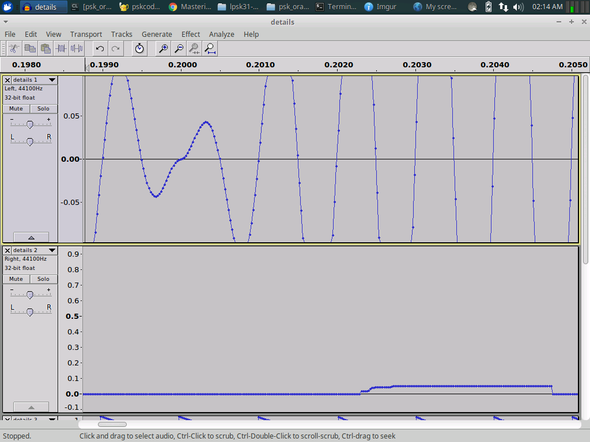

# psk_orange
Homebrew psk31 codec. The codec only does a delta-code, not the varicode standard psk31 uses. This may be a project for another time - or perhaps you can work on it in a fork of your own.

Main() calls an encoder to write the ascii string "Hello World!" to the screen and into a headerless uncompressed uint16 binary audio file using a sampling rate of 22050hz and a tone frequency of 500hz. This audio file is then read back and decoded to the screen.

This is the ascii of the encoded string:
`00010010 10100110 00110110 00110110 11110110 00000100 11101010 11110110 01001110 00110110 00100110 10000100 `

And this is the ascii of the decoded string:
`00010010 10100110 00110110 00110110 11110110 00000100 11101010 11110110 01001110 00110110 00100110 10000100 0`

The terminating bit (sometimes 1, sometimes 0) is a remanant of how the decoding works - a 0 designates no bit-delta between the last bit and the ending carrier (which is always phase 0). I think it can be ignored when decoding.

The first 5 bits of the letter H (in Hello World) is shown below. What you are looking at is a long 150 cycle (@500hz) carrier followed by several 50 cycle (@500hz) elements. The phase changes between consecutive elements is the bit-delta-coding.

When the phase between elements remains the same this is an encoding for no bit-change. 

When the phase changes between elements this is an encoding for a bit-change. 

To reduce high frequencies artifacts the phase changes between elements occur between the elements - during attenuation. This attanuation is specially timed to occur at whole integer multiples of the wavelength - also to reduce high frequency artifacts.
